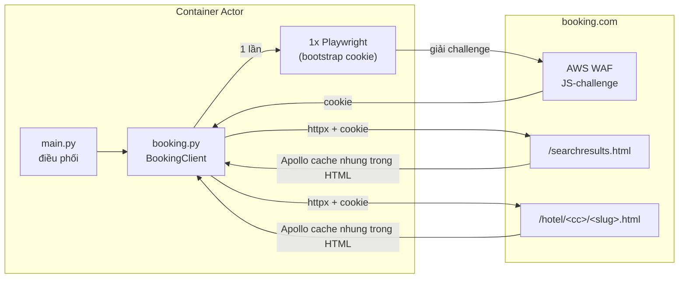

# Booking.com Hotel Scraper

Trích xuất dữ liệu khách sạn có cấu trúc từ Booking.com: thông tin khách sạn, điểm review theo
hạng mục, loại phòng, tiện nghi, tọa độ và hình ảnh — bằng cách đọc khối GraphQL cache (Apollo)
nhúng sẵn trong HTML thay vì parse DOM, giúp bền vững hơn khi giao diện thay đổi.

> Actor anh em với [Agoda Hotel Scraper](https://github.com/NhatLam71388/Craw_data_agoda) —
> cùng triết lý (đọc dữ liệu có cấu trúc thay vì cào HTML), khác kỹ thuật vượt rào cản (xem
> "Kiến trúc" bên dưới).

---

## Kiến trúc & khác biệt so với actor Agoda

Booking.com có **AWS WAF JS-challenge** chặn mọi request không phải từ trình duyệt thật (khác
Agoda — không có bảo vệ gì, gọi httpx thuần luôn được). Actor này cần **1 bước "bootstrap"**
bằng Playwright (headless Chromium) để trình duyệt tự giải challenge, sau đó **lấy cookie tái
sử dụng cho httpx thuần** ở toàn bộ request còn lại — đã kiểm chứng: không cần mở lại trình
duyệt cho mỗi request, chỉ mở lại khi phát hiện dấu hiệu challenge quay lại (cookie hết hạn).



Vì Docker image cần cài Chromium, actor này **nặng và khởi động chậm hơn** actor Agoda. Dùng
base image `apify/actor-python-playwright` (đã có sẵn Playwright + trình duyệt khớp phiên bản).

---

## Tính năng

- Nhận **từ khóa tìm kiếm** (tên khách sạn), **URL trang khách sạn**, hoặc **tên vùng/thành
  phố** làm đầu vào — Booking.com dùng chung 1 endpoint tìm kiếm cho cả 2 trường hợp.
- Trả về: tên, địa chỉ, tọa độ, điểm review tổng + theo hạng mục, loại phòng, tiện nghi từng
  phòng, ảnh.
- Hỗ trợ đa ngôn ngữ (dữ liệu trả về theo `language`) và đa tiền tệ hiển thị (`currency`).
- Hỗ trợ **proxy** và **giới hạn tần suất** để giảm nguy cơ bị chặn.
- Bắt lỗi theo từng khách sạn: một lỗi không làm hỏng cả run.

### Giới hạn đã biết (v1) — xem chi tiết trong `src/booking.py`

- **Tìm theo vùng chỉ lấy được ~25 khách sạn/vùng** (trang đầu). Booking.com có hàng nghìn kết
  quả mỗi thành phố lớn nhưng phân trang thật chạy qua 1 lời gọi GraphQL phía client (biến
  `pagination.offset`) mà actor **chưa reverse-engineer được** cách kích hoạt đúng — thử `offset=`
  trên URL không có tác dụng (trang luôn server-render trang đầu). Nếu bạn cần nhiều hơn 25
  khách sạn/vùng, dùng nhiều từ khóa `locations` cụ thể hơn (theo quận/khu vực nhỏ) thay vì 1
  thành phố lớn.
- **Chưa lấy được giá phòng thực tế theo ngày check-in**: dù truyền đủ `checkin`/`checkout`/
  `group_adults`/`no_rooms` vào URL, bảng giá phòng (`RoomTableQueryResult.roomCards`) vẫn trả
  về rỗng — có thể Booking.com cần 1 phiên bắt nguồn từ trang tìm kiếm (referrer) hoặc 1 cơ chế
  client-side khác chưa xác định. Các trường `price`, `currency`, `rooms_available` hiện luôn
  `null`. **Đây là việc cần nghiên cứu tiếp** (tương tự cách actor Agoda cũng thêm tính năng giá
  sau, không phải từ bản đầu tiên).
- `hotelIds` **không hỗ trợ ID số đơn thuần** như Agoda (Booking.com không có cơ chế redirect
  tương đương `?hid=`) — phải cung cấp dạng `<mã quốc gia>/<slug>` (vd `vn/the-chum-boutique`,
  lấy từ URL thật) hoặc dùng `propertyUrls`.

---

## Input

| Field | Kiểu | Mô tả |
|-------|------|-------|
| `searchTerms` | array (string) | Tên khách sạn cụ thể (vd `"The Chum Boutique Hue"`). |
| `propertyUrls` | array (string) | URL trang khách sạn Booking.com. Nếu URL có sẵn `checkin`/`checkout`/`group_adults`/`no_rooms`, actor dùng luôn các tham số đó. |
| `hotelIds` | array (string) | Dạng `<mã quốc gia>/<slug>` (vd `vn/the-chum-boutique`) — **không phải ID số đơn thuần** (xem giới hạn ở trên). |
| `locations` | array (string) | Tên vùng/thành phố (vd `"Hue"`) hoặc link trang search Booking.com (vd `https://www.booking.com/searchresults.html?ss=Hue`). Giới hạn ~25 khách sạn/vùng (xem giới hạn ở trên). |
| `maxItemsPerLocation` | integer | Số khách sạn tối đa lấy cho mỗi vùng (thực tế bị chặn ở ~25 do giới hạn phân trang). Mặc định `50`. |
| `checkIn` | string | Ngày check-in mặc định (`YYYY-MM-DD`) cho khách sạn không có sẵn ngày từ URL. **Hiện chưa cho ra giá thực tế** (xem giới hạn) nhưng vẫn được gửi kèm request để sẵn sàng khi tìm ra cơ chế đúng. |
| `lengthOfStay` | integer | Số đêm ở lại, dùng cùng `checkIn`. Mặc định `1`. |
| `adults` / `rooms` | integer | Số người lớn / số phòng, dùng cùng `checkIn`. Mặc định `2` / `1`. |
| `currency` | string | Mã tiền tệ hiển thị (vd `USD`, `VND`). Mặc định `USD`. |
| `language` | string | Ngôn ngữ kết quả: `en-us` (mặc định), `vi`, `th`, `ko`, `ja`, `zh-cn`, `id`. |
| `maxItems` | integer | Số bản ghi tối đa trên tất cả nguồn. `0` = không giới hạn. |
| `requestDelay` | integer | Số giây chờ giữa các request (0–30). Mặc định `2`. |
| `proxyConfiguration` | object | Cấu hình proxy. Mặc định Apify Residential. |

### Ví dụ input — tìm 1 khách sạn cụ thể

```json
{
  "searchTerms": ["The Chum Boutique Hue"],
  "language": "vi",
  "currency": "VND",
  "requestDelay": 2,
  "proxyConfiguration": { "useApifyProxy": true, "apifyProxyGroups": ["RESIDENTIAL"] }
}
```

### Ví dụ input — tìm theo vùng (tối đa ~25 khách sạn)

```json
{
  "locations": ["Hue"],
  "maxItemsPerLocation": 25,
  "language": "vi",
  "currency": "VND"
}
```

---

## Output (mỗi bản ghi vào Dataset)

| Field | Mô tả |
|-------|-------|
| `hotel_id` / `hotel_name` | Định danh & tên |
| `accommodation_type` | Loại hình (vd `HOTEL`) |
| `address` / `city` / `country` | Vị trí (`country` là mã 2 chữ, vd `vn`) |
| `review_score` / `review_count` | Điểm & số lượng review tổng |
| `category_scores` | Điểm theo hạng mục — **nhãn đã dịch theo `language`** (vd `{"Nhân viên phục vụ": 9.4, "Địa điểm": 9.5, ...}`), lấy trực tiếp từ Booking.com nên đúng cho mọi ngôn ngữ |
| `price` / `currency` / `rooms_available` | **Hiện luôn `null`** — xem "Giới hạn đã biết" |
| `check_in` / `check_out` | Ngày dùng để tính giá (nếu có cấp `checkIn`), `null` nếu không |
| `room_types` | Danh sách tên loại phòng |
| `rooms` | Chi tiết từng phòng: `name`, `room_id`, `amenities` (tiện nghi phòng), `image_count`, `images` (toàn bộ ảnh phòng), `price_per_night`/`currency`/`sold_out` (hiện luôn `null`) |
| `coordinates` | Toạ độ dạng chuỗi `"lat,lng"` — dán thẳng được vào Google Maps |
| `property_url` | URL trang khách sạn |
| `warnings` | Cảnh báo parse (rỗng nếu bình thường) |
| `scraped_at` | Thời điểm crawl (ISO-8601 UTC) |

---

## Cơ chế hoạt động

1. **Bootstrap** — mở 1 phiên Playwright headless, vào `booking.com`, chờ AWS WAF JS-challenge
   tự giải trong trình duyệt, lấy cookie từ browser context, áp vào httpx client. Nếu 1 request
   sau đó vẫn có dấu hiệu challenge (status `202` hoặc body chứa `awsWafCookieDomainList`), tự
   bootstrap lại 1 lần.
2. **Tìm kiếm** (`searchTerms`/`locations`) — `GET /searchresults.html?ss=<tu khoa>` → tách khối
   `<script type="application/json">` chứa `"ROOT_QUERY"` (Apollo cache đã normalize) → đọc
   `ROOT_QUERY.searchQueries["search(...)"].results[]`.
3. **Chi tiết khách sạn** — `GET /hotel/<cc>/<slug>.html` → cùng kỹ thuật tách Apollo cache →
   `BasicPropertyData` (tên, địa chỉ, tọa độ), `PropertyReview` (điểm tổng),
   `ROOT_QUERY.reviewsFrontend(...).ratingScores[]` (điểm theo hạng mục, đã dịch sẵn),
   `RoomData` (phòng: tên, tiện nghi qua `BaseFacility`→`Instance`, ảnh qua `RoomPhoto`).

> Booking.com không công bố API nên schema có thể đổi theo thời gian. Nếu kết quả rỗng/lỗi, mở
> DevTools > Network trên 1 trang search hoặc chi tiết khách sạn, tìm thẻ
> `<script type="application/json" data-capla-application-context...>`, xác nhận vẫn có
> `"ROOT_QUERY"` và cấu trúc tương tự.

---

## Dùng qua API

### Python

```python
from apify_client import ApifyClient

client = ApifyClient("<YOUR_API_TOKEN>")
run = client.actor("<username>/booking-scraper").call(
    run_input={"searchTerms": ["The Chum Boutique Hue"]}
)
for item in client.dataset(run["defaultDatasetId"]).iterate_items():
    print(item)
```

### CLI

```bash
echo '{ "searchTerms": ["The Chum Boutique Hue"] }' | apify call <username>/booking-scraper --silent --output-dataset
```
