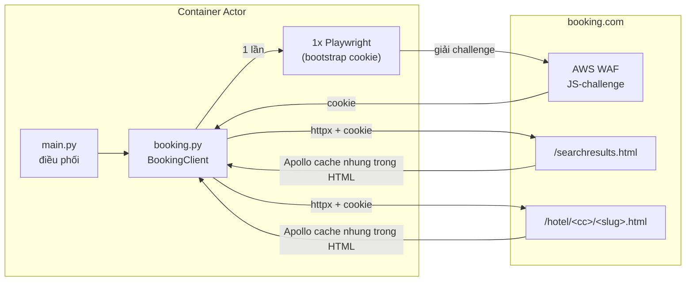

# Booking.com Hotel Scraper

Trích xuất dữ liệu khách sạn có cấu trúc từ Booking.com: thông tin khách sạn, điểm review theo
hạng mục, loại phòng, tiện nghi, tọa độ và hình ảnh — bằng cách đọc khối GraphQL cache (Apollo)
nhúng sẵn trong HTML thay vì parse DOM, giúp bền vững hơn khi giao diện thay đổi.

> Actor anh em với [Agoda Hotel Scraper](https://github.com/NhatLam71388/Craw_data_agoda) —
> cùng triết lý (đọc dữ liệu có cấu trúc thay vì cào HTML), khác kỹ thuật vượt rào cản (xem
> "Kiến trúc" bên dưới).

---

## Kiến trúc & khác biệt so với actor Agoda

Booking.com có **AWS WAF JS-challenge** chặn mọi request không phải từ trình duyệt thật (khác
Agoda — không có bảo vệ gì, gọi httpx thuần luôn được). Actor này cần **1 bước "bootstrap"**
bằng Playwright (headless Chromium) để trình duyệt tự giải challenge, sau đó **lấy cookie tái
sử dụng cho httpx thuần** ở toàn bộ request còn lại — đã kiểm chứng: không cần mở lại trình
duyệt cho mỗi request, chỉ mở lại khi phát hiện dấu hiệu challenge quay lại (cookie hết hạn).



Vì Docker image cần cài Chromium, actor này **nặng và khởi động chậm hơn** actor Agoda. Dùng
base image `apify/actor-python-playwright` (đã có sẵn Playwright + trình duyệt khớp phiên bản).

---

## Tính năng

- Nhận **từ khóa tìm kiếm** (tên khách sạn), **URL trang khách sạn**, hoặc **tên vùng/thành
  phố** làm đầu vào — Booking.com dùng chung 1 endpoint tìm kiếm cho cả 2 trường hợp.
- Trả về: tên, địa chỉ, tọa độ, hạng sao, điểm review tổng + theo hạng mục, tiện nghi, ảnh, loại
  phòng, tiện nghi từng phòng.
- **Giá thực tế theo ngày check-in** cho khách sạn tìm qua `searchTerms`/`locations` kèm
  `checkIn` (hoặc URL vùng có sẵn `checkin`/`checkout`) — xem "Cơ chế hoạt động".
- Hỗ trợ đa ngôn ngữ (dữ liệu trả về theo `language`) và đa tiền tệ hiển thị (`currency`).
- Hỗ trợ **proxy** và **giới hạn tần suất** để giảm nguy cơ bị chặn.
- Bắt lỗi theo từng khách sạn: một lỗi không làm hỏng cả run.

### Giới hạn đã biết (v1) — xem chi tiết trong `src/booking.py`

- **1 lần tải trang tìm kiếm chỉ trả về ~25 khách sạn**. Booking.com có hàng nghìn kết quả mỗi
  thành phố lớn nhưng phân trang thật chạy qua 1 lời gọi GraphQL phía client (biến
  `pagination.offset`) mà actor **chưa reverse-engineer được** cách kích hoạt đúng — thử
  `offset=`/`page=`/`start=` trên URL đều không có tác dụng (trang luôn server-render trang
  đầu). Actor **lách qua giới hạn này** bằng cách tự gọi nhiều lần với các tổ hợp tham số lọc
  hạng sao (`nflt=class=1..5`) + sắp xếp (`order=price/bayesian_review_score/
  distance_from_search/popularity`) — đã xác nhận Booking.com áp dụng CẢ HAI server-side (tổng
  số kết quả và danh sách khách sạn thay đổi thật theo từng giá trị), nên mỗi tổ hợp trả về 1
  "trang" ~25 khách sạn chủ yếu khác nhau; actor gộp + loại trùng theo `hotel_id` cho tới khi đủ
  `maxItemsPerLocation` (mặc định 50, có thể đặt tới 200+, xem input). Lưu ý: mỗi ~25 khách sạn
  cần 1 request HTTP riêng, nên `maxItemsPerLocation` lớn sẽ tốn nhiều thời gian/request hơn;
  với vùng có ít khách sạn thật (vd < 25), actor tự dừng sớm khi các tổ hợp không còn khách sạn
  mới. Nếu vẫn cần nhiều hơn (vd > 200/vùng), có thể kết hợp thêm nhiều từ khóa `locations` cụ
  thể hơn (theo quận/khu vực nhỏ).
- **Giá chỉ có khi có `checkIn`** (ngày nhận phòng) — dù qua `searchTerms`/`locations`
  (tự động có, đi qua bước tìm kiếm) hay `propertyUrls`/`hotelIds` (cần URL có sẵn
  `checkin`/`checkout` hoặc bạn cấp `checkIn` ở input). Không có ngày → `price`/`currency`/
  `rooms_available` và toàn bộ `rooms[].price_per_night`/`currency`/`sold_out` đều `null`.
  Có 2 nguồn giá độc lập, actor dùng cả 2: (1) **trang kết quả tìm kiếm**
  (`priceDisplayInfoIrene`, chỉ có khi đi qua `searchTerms`/`locations`) — ưu tiên cao hơn vì
  đáng tin cậy hơn khi có; (2) khối JSON "legacy" `b_rooms_available_and_soldout` nhúng ngay
  trong HTML **trang chi tiết khách sạn** — nguồn NÀY vừa cho giá/tình trạng **từng loại
  phòng**, vừa được dùng làm fallback cho giá cấp khách sạn khi nguồn (1) không có (tức khi
  dùng `propertyUrls`/`hotelIds`). Lưu ý: `RoomTableQueryResult.roomCards` (qua Apollo/GraphQL)
  vẫn luôn rỗng — đây KHÔNG phải nguồn giá, xem "Cơ chế hoạt động".
- `hotelIds` **không hỗ trợ ID số đơn thuần** như Agoda (Booking.com không có cơ chế redirect
  tương đương `?hid=`) — phải cung cấp dạng `<mã quốc gia>/<slug>` (vd `vn/the-chum-boutique`,
  lấy từ URL thật) hoặc dùng `propertyUrls`.
- **Dữ liệu phòng chi tiết (`bed`/`size`/`max_occupancy`) đôi khi thiếu ở 1 vài phòng**: nguồn
  `RoomDetails` có tỷ lệ ~1/4 phiên bị thiếu hoàn toàn (biến thể gắn theo session/cookie, không
  phải lỗi mạng) — actor tự **bootstrap lại** (lấy cookie mới) và thử lại tối đa 3 lần khi phát
  hiện thiếu, nhưng không đảm bảo 100%. `view`/`amenities`/giá/`sold_out` (lấy từ nguồn khác ổn
  định hơn) không bị ảnh hưởng.
- **`rooms[].review_score`/`review_text` luôn `null`** — khác `price_per_night`/`currency`/
  `sold_out` (đã có nguồn, xem mục trên), đây là field **Booking.com không có tương đương ở cấp
  từng loại phòng** (đã đối chiếu dataset thật, chỉ Agoda có review theo phòng) — không phải
  giới hạn kỹ thuật, không có nguồn nào để tìm thêm.

---

## Input

| Field | Kiểu | Mô tả |
|-------|------|-------|
| `searchTerms` | array (string) | Tên khách sạn cụ thể (vd `"The Chum Boutique Hue"`). |
| `propertyUrls` | array (string) | URL trang khách sạn Booking.com. Không đi qua bước tìm kiếm, nhưng vẫn **có giá** (kể cả `rooms[].price_per_night`) nếu URL có sẵn `checkin`/`checkout` hoặc bạn cấp `checkIn` ở input (xem "Giới hạn đã biết" — nguồn giá fallback riêng cho trường hợp này). |
| `hotelIds` | array (string) | Dạng `<mã quốc gia>/<slug>` (vd `vn/the-chum-boutique`) — **không phải ID số đơn thuần** (xem giới hạn ở trên). Giá hoạt động giống `propertyUrls` (cần `checkIn`). |
| `locations` | array (string) | Tên vùng/thành phố (vd `"Hue"`) hoặc link trang search Booking.com (vd `https://www.booking.com/searchresults.html?ss=Hue&checkin=2026-08-01&checkout=2026-08-03`). Nếu link có `checkin`/`checkout`/`group_adults`/`no_rooms`, mọi khách sạn tìm được sẽ có **giá thực tế**. |
| `maxItemsPerLocation` | integer | Số khách sạn tối đa lấy cho mỗi vùng (vd `200`) — actor tự gọi nhiều lần với các tổ hợp lọc/sắp xếp khác nhau để gom đủ số lượng (xem "Giới hạn đã biết"). Mặc định `50`. |
| `checkIn` | string | Ngày check-in mặc định (`YYYY-MM-DD`, chọn qua date-picker trên Console) cho `searchTerms`/`locations` không có sẵn ngày từ URL — **cho ra giá thực tế**. Không ảnh hưởng `propertyUrls`/`hotelIds` (xem giới hạn ở trên). |
| `checkOut` | string | Ngày check-out (`YYYY-MM-DD`, date-picker). Nếu bỏ trống, tự tính từ `checkIn` + `lengthOfStay`. |
| `lengthOfStay` | integer | Số đêm ở lại — chỉ dùng khi **không** cấp `checkOut`. Mặc định `1`. |
| `adults` / `rooms` | integer | Số người lớn / số phòng, dùng cùng `checkIn`. Mặc định `2` / `1`. |
| `currency` | string | Mã tiền tệ hiển thị (vd `USD`, `VND`). Mặc định `USD`. |
| `language` | string | Ngôn ngữ kết quả: `en-us` (mặc định), `vi`, `th`, `ko`, `ja`, `zh-cn`, `id`. |
| `maxItems` | integer | Số bản ghi tối đa trên tất cả nguồn. `0` = không giới hạn. |
| `requestDelay` | integer | Số giây chờ giữa các request (0–30). Mặc định `2`. |
| `proxyConfiguration` | object | Cấu hình proxy. Mặc định Apify Residential. |

### Ví dụ input — tìm 1 khách sạn cụ thể

```json
{
  "searchTerms": ["The Chum Boutique Hue"],
  "language": "vi",
  "currency": "VND",
  "requestDelay": 2,
  "proxyConfiguration": { "useApifyProxy": true, "apifyProxyGroups": ["RESIDENTIAL"] }
}
```

### Ví dụ input — tìm theo vùng (vd 200 khách sạn)

```json
{
  "locations": ["Hue"],
  "maxItemsPerLocation": 200,
  "language": "vi",
  "currency": "VND"
}
```

### Ví dụ input — kèm giá thực tế theo ngày check-in

```json
{
  "locations": ["Ho Chi Minh City"],
  "checkIn": "2026-08-01",
  "checkOut": "2026-08-03",
  "adults": 2,
  "rooms": 1,
  "language": "vi",
  "currency": "VND"
}
```

> Không chọn `checkOut`? Actor tự tính bằng `checkIn` + `lengthOfStay` (mặc định `1` đêm) như
> trước đây.

---

## Output (mỗi bản ghi vào Dataset)

| Field | Mô tả |
|-------|-------|
| `hotel_id` / `hotel_name` | Định danh & tên |
| `accommodation_type` | Loại hình (vd `HOTEL`) |
| `star_rating` | Hạng sao chính thức (thường `null` với homestay/căn hộ nhỏ — Booking.com không bắt buộc khai báo) |
| `address` / `city` / `area_name` / `country` | Vị trí (`area_name` là tên quận/khu vực, vd `"Quận 1"` — `null` nếu khách sạn ở ngoài khu vực có breadcrumb quận; `country` là mã 2 chữ, vd `vn`) |
| `review_score` / `review_count` | Điểm & số lượng review tổng |
| `category_scores` | Điểm theo hạng mục — **nhãn đã dịch theo `language`** (vd `{"Nhân viên phục vụ": 9.4, "Địa điểm": 9.5, ...}`), lấy trực tiếp từ Booking.com nên đúng cho mọi ngôn ngữ |
| `amenities` / `amenity_groups` | Tiện nghi đầy đủ (phẳng & theo nhóm, vd `{"Phòng tắm": [...], "Đồ ăn & thức uống": [...]}`) — nhãn đã dịch theo `language` |
| `nearby_attractions` | Điểm tham quan gần: `name`, `distance_km`, `distance_text`, `coordinates` (toạ độ riêng của điểm đó, dạng `"lat,lng"` — không phải toạ độ khách sạn) |
| `nearby_essentials` | Sân bay/giao thông công cộng gần: `category`, `name`, `distance_km`, `distance_text`, `coordinates` (toạ độ riêng của điểm đó) |
| `price` / `currency` / `rooms_available` | Giá rẻ nhất/đêm trong số các loại phòng còn hàng + số loại phòng còn hàng — **cần có `checkIn`** (từ `searchTerms`/`locations` hoặc `propertyUrls`/`hotelIds` kèm ngày), `null` nếu không có ngày (xem "Giới hạn đã biết"). Giá VND được làm tròn số nguyên (không thập phân). |
| `check_in` / `check_out` | Ngày dùng để tính giá (nếu có cấp `checkIn`), `null` nếu không |
| `check_in_time` / `check_in_until` / `check_out_time` | Giờ nhận phòng từ / nhận phòng đến (muộn nhất, thường `null` — không phải khách sạn nào cũng giới hạn) / trả phòng đến (vd `15:00` / `null` / `12:00`) |
| `room_types` | Danh sách tên loại phòng |
| `rooms` | Chi tiết từng phòng: `name`, `room_id`, `bed`, `size` (vd `"40 m²"`), `max_occupancy` (số khách tối đa), `view`, `amenities` (tiện nghi phòng), `image_count`, `images` (toàn bộ ảnh phòng), `price_per_night`/`currency`/`sold_out` (cần `checkIn`, `null` nếu không có — xem "Giới hạn đã biết"). `review_score`/`review_text` **luôn `null`** — Booking.com không có field tương đương ở cấp từng loại phòng (chỉ Agoda có, không phải giới hạn kỹ thuật). Lưu ý: `bed` luôn hiển thị tiếng Anh đơn giản bất kể `language` (Booking không trả nhãn giường đã dịch, khác các field khác). |
| `image_url` / `image_count` / `all_images` | Ảnh khách sạn (toàn bộ thư viện ảnh) |
| `coordinates` | Toạ độ dạng chuỗi `"lat,lng"` — dán thẳng được vào Google Maps |
| `property_url` | URL trang khách sạn |
| `warnings` | Cảnh báo parse: `missing_name`/`missing_geo`/`surroundings_unavailable`/`facilities_unavailable` (rỗng nếu bình thường) |
| `scraped_at` | Thời điểm crawl (ISO-8601 UTC) |

---

## Cơ chế hoạt động

1. **Bootstrap** — mở 1 phiên Playwright headless, vào `booking.com`, chờ AWS WAF JS-challenge
   tự giải trong trình duyệt, lấy cookie từ browser context, áp vào httpx client. Nếu 1 request
   sau đó vẫn có dấu hiệu challenge (status `202` hoặc body chứa `awsWafCookieDomainList`), tự
   bootstrap lại 1 lần.
2. **Tìm kiếm** (`searchTerms`/`locations`) — `GET /searchresults.html?ss=<tu khoa>` (kèm
   `checkin`/`checkout`/`group_adults`/`no_rooms` nếu có `checkIn`) → tách khối
   `<script type="application/json">` chứa `"ROOT_QUERY"` (Apollo cache đã normalize) → đọc
   `ROOT_QUERY.searchQueries["search(...)"].results[]`. **Đây là nguồn giá CẤP KHÁCH SẠN ưu
   tiên** — mỗi kết quả có sẵn `priceDisplayInfoIrene.displayPrice.amountPerStay` (tổng giá cả
   kỳ nghỉ), actor tự chia cho số đêm để ra giá/đêm. Chỉ có khi đi qua bước tìm kiếm này (không
   áp dụng cho `propertyUrls`/`hotelIds` — 2 input này dùng nguồn giá riêng ở bước 3).
3. **Chi tiết khách sạn** — `GET /hotel/<cc>/<slug>.html` → cùng kỹ thuật tách Apollo cache →
   `BasicPropertyData` (tên, địa chỉ, tọa độ), `PropertyReview` (điểm tổng),
   `ROOT_QUERY.reviewsFrontend(...).ratingScores[]` (điểm theo hạng mục, đã dịch sẵn),
   `ROOT_QUERY.hotelPageByPageName(...).propertyFullExtended.starRating` (hạng sao, là 1
   tham chiếu tới `StarRating.value`), `Property.propertyGallery(...).mainGalleryPhotos[]`
   (ảnh), `ROOT_QUERY.breadcrumbs(...).breadcrumbItems[]` lọc `type=="district"` (khu vực),
   `Property.houseRules.checkinCheckoutTimes` (giờ nhận/trả phòng). Phòng (`rooms[]`) gộp 2
   nguồn theo cùng 1 id: `RoomData` (tên, ảnh, tiện nghi/view qua `BaseFacility`→`Instance`,
   lọc `groupId==14` ra `view`) và `RoomDetails` (`roomSizeM2`, `bedConfigurations`,
   `occupancy`) — cả 2 là entity "mồ côi" trong cache (không có gì tham chiếu `__ref` tới,
   vì `RoomTableQueryResult.roomCards` đáng lẽ link chúng lại rỗng) nhưng vẫn đọc được trực
   tiếp. `RoomDetails` có tỷ lệ thiếu ~1/4 phiên (xem "Giới hạn đã biết") nên actor tự
   bootstrap lại + thử lại khi phát hiện thiếu.
   **Giá/tình trạng từng phòng** (`rooms[].price_per_night`/`currency`/`sold_out`) **không**
   nằm trong Apollo cache — `RoomTableQueryResult.roomCards` (nơi lẽ ra chứa) luôn rỗng. Nguồn
   thật là 1 khối **JSON hợp lệ riêng biệt** (không phải GraphQL) nhúng thẳng trong HTML dưới
   dạng biến JS "legacy" `b_rooms_available_and_soldout` — actor tách bằng đếm ngoặc (không
   phải regex, vì nội dung lồng nhau sâu) rồi `json.loads()` riêng đoạn đó. Danh sách này chỉ
   liệt kê phòng **còn hàng** cho đúng ngày/số khách đã yêu cầu — mỗi phòng (khớp `room_id` với
   `RoomData`) có nhiều "block" (tổ hợp chính sách hủy/bữa sáng khác nhau, mỗi block có giá
   riêng); actor lấy block **rẻ nhất** làm `price_per_night`. Phòng bị loại hoàn toàn khỏi danh
   sách này (không có mặt) → `sold_out=True`. Cấp khách sạn (`price`/`currency`/
   `rooms_available`), nếu không có sẵn từ bước tìm kiếm (mục 2), sẽ **fallback** sang chính
   nguồn này: `price` = giá rẻ nhất trong các phòng còn hàng, `rooms_available` = số loại phòng
   còn hàng.
4. **2 lời gọi bổ sung** (không nằm trong cache SSR chính, phải gọi riêng qua
   `POST /dml/graphql`, xem `src/property_extras_query.py`):
   - `PropertySurroundingsBlockDesktop` → `nearby_attractions`/`nearby_essentials`. Gửi
     kèm **query text đầy đủ** đã bắt được qua Playwright network capture.
   - `Facilities` → `amenities`/`amenity_groups` đầy đủ (nối `facilities[]` với
     `facilityGroups[]` qua `groupId`). Dùng **Automatic Persisted Query (APQ)**: chỉ cần
     gửi `sha256Hash`, không cần gửi query text — server đã cache sẵn theo hash, dùng
     chung cho mọi client (không phụ thuộc session).
   - Cả 2 lời gọi đọc ngôn ngữ qua header `Accept-Language` (khác GET request thường dùng
     param `lang=` trên URL) — actor tự map `language` sang locale tương ứng (vd `vi` →
     `vi-VN,vi;q=0.9`).
   - Nếu 1 trong 2 lời gọi này thất bại, record vẫn được lưu bình thường (chỉ để trống
     trường tương ứng + thêm cảnh báo vào `warnings`).

> Booking.com không công bố API nên schema có thể đổi theo thời gian. Nếu kết quả rỗng/lỗi, mở
> DevTools > Network trên 1 trang search hoặc chi tiết khách sạn, tìm thẻ
> `<script type="application/json" data-capla-application-context...>`, xác nhận vẫn có
> `"ROOT_QUERY"` và cấu trúc tương tự.

---

## Dùng qua API

### Python

```python
from apify_client import ApifyClient

client = ApifyClient("<YOUR_API_TOKEN>")
run = client.actor("<username>/booking-scraper").call(
    run_input={"searchTerms": ["The Chum Boutique Hue"]}
)
for item in client.dataset(run["defaultDatasetId"]).iterate_items():
    print(item)
```

### CLI

```bash
echo '{ "searchTerms": ["The Chum Boutique Hue"] }' | apify call <username>/booking-scraper --silent --output-dataset
```
