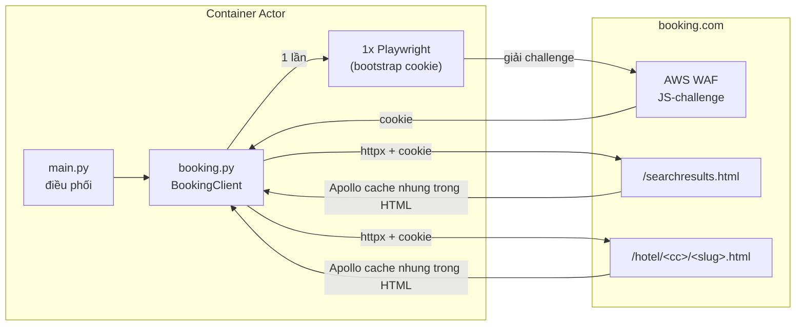

# Booking.com Hotel Scraper

Trích xuất dữ liệu khách sạn có cấu trúc từ Booking.com: thông tin khách sạn, điểm review theo
hạng mục, loại phòng, tiện nghi, tọa độ và hình ảnh — bằng cách đọc khối GraphQL cache (Apollo)
nhúng sẵn trong HTML thay vì parse DOM, giúp bền vững hơn khi giao diện thay đổi.

> Actor anh em với [Agoda Hotel Scraper](https://github.com/NhatLam71388/Craw_data_agoda) —
> cùng triết lý (đọc dữ liệu có cấu trúc thay vì cào HTML), khác kỹ thuật vượt rào cản (xem
> "Kiến trúc" bên dưới).

---

## Kiến trúc & khác biệt so với actor Agoda

Booking.com có **AWS WAF JS-challenge** chặn mọi request không phải từ trình duyệt thật (khác
Agoda — không có bảo vệ gì, gọi httpx thuần luôn được). Actor này cần **1 bước "bootstrap"**
bằng Playwright (headless Chromium) để trình duyệt tự giải challenge, sau đó **lấy cookie tái
sử dụng cho httpx thuần** ở toàn bộ request còn lại — đã kiểm chứng: không cần mở lại trình
duyệt cho mỗi request, chỉ mở lại khi phát hiện dấu hiệu challenge quay lại (cookie hết hạn).



Vì Docker image cần cài Chromium, actor này **nặng và khởi động chậm hơn** actor Agoda. Dùng
base image `apify/actor-python-playwright` (đã có sẵn Playwright + trình duyệt khớp phiên bản).

---

## Tính năng

- Nhận **từ khóa tìm kiếm** (tên khách sạn), **URL trang khách sạn**, hoặc **tên vùng/thành
  phố** làm đầu vào — Booking.com dùng chung 1 endpoint tìm kiếm cho cả 2 trường hợp.
- Trả về: tên, địa chỉ, tọa độ, hạng sao, điểm review tổng + theo hạng mục, tiện nghi, ảnh, loại
  phòng, tiện nghi từng phòng.
- **Giá thực tế theo ngày check-in** cho khách sạn tìm qua `searchTerms`/`locations` kèm
  `checkIn` (hoặc URL vùng có sẵn `checkin`/`checkout`) — xem "Cơ chế hoạt động".
- Hỗ trợ đa ngôn ngữ (dữ liệu trả về theo `language`) và đa tiền tệ hiển thị (`currency`).
- Hỗ trợ **proxy** và **giới hạn tần suất** để giảm nguy cơ bị chặn.
- Bắt lỗi theo từng khách sạn: một lỗi không làm hỏng cả run.

### Giới hạn đã biết (v1) — xem chi tiết trong `src/booking.py`

- **Tìm theo vùng chỉ lấy được ~25 khách sạn/vùng** (trang đầu). Booking.com có hàng nghìn kết
  quả mỗi thành phố lớn nhưng phân trang thật chạy qua 1 lời gọi GraphQL phía client (biến
  `pagination.offset`) mà actor **chưa reverse-engineer được** cách kích hoạt đúng — thử `offset=`
  trên URL không có tác dụng (trang luôn server-render trang đầu). Nếu bạn cần nhiều hơn 25
  khách sạn/vùng, dùng nhiều từ khóa `locations` cụ thể hơn (theo quận/khu vực nhỏ) thay vì 1
  thành phố lớn.
- **Giá chỉ có khi khách sạn được tìm qua `searchTerms`/`locations`** (đi qua bước tìm kiếm).
  Trang chi tiết khách sạn (`RoomTableQueryResult.roomCards`) luôn trả về rỗng dù truyền đủ
  `checkin`/`checkout`/`group_adults`/`no_rooms` — giá thật thực ra nằm ở chính **trang kết quả
  tìm kiếm** (`priceDisplayInfoIrene`), không phải trang chi tiết. Vì vậy: dùng trực tiếp
  `propertyUrls`/`hotelIds` (không qua tìm kiếm) sẽ **không có giá** (`price`/`currency`/
  `rooms_available` là `null`) — muốn có giá, dùng `searchTerms` hoặc `locations` kèm `checkIn`.
  Giá phòng riêng lẻ từng loại phòng (`rooms[].price_per_night`) vẫn chưa lấy được (chỉ có giá
  tổng hợp `price` ở cấp khách sạn).
- `hotelIds` **không hỗ trợ ID số đơn thuần** như Agoda (Booking.com không có cơ chế redirect
  tương đương `?hid=`) — phải cung cấp dạng `<mã quốc gia>/<slug>` (vd `vn/the-chum-boutique`,
  lấy từ URL thật) hoặc dùng `propertyUrls`.

---

## Input

| Field | Kiểu | Mô tả |
|-------|------|-------|
| `searchTerms` | array (string) | Tên khách sạn cụ thể (vd `"The Chum Boutique Hue"`). |
| `propertyUrls` | array (string) | URL trang khách sạn Booking.com. Không đi qua bước tìm kiếm nên **không có giá** (xem giới hạn ở trên), dù URL có sẵn `checkin`/`checkout`. |
| `hotelIds` | array (string) | Dạng `<mã quốc gia>/<slug>` (vd `vn/the-chum-boutique`) — **không phải ID số đơn thuần** (xem giới hạn ở trên). Cũng không có giá (giống `propertyUrls`). |
| `locations` | array (string) | Tên vùng/thành phố (vd `"Hue"`) hoặc link trang search Booking.com (vd `https://www.booking.com/searchresults.html?ss=Hue&checkin=2026-08-01&checkout=2026-08-03`). Giới hạn ~25 khách sạn/vùng. Nếu link có `checkin`/`checkout`/`group_adults`/`no_rooms`, mọi khách sạn tìm được sẽ có **giá thực tế**. |
| `maxItemsPerLocation` | integer | Số khách sạn tối đa lấy cho mỗi vùng (thực tế bị chặn ở ~25 do giới hạn phân trang). Mặc định `50`. |
| `checkIn` | string | Ngày check-in mặc định (`YYYY-MM-DD`) cho `searchTerms`/`locations` không có sẵn ngày từ URL — **cho ra giá thực tế**. Không ảnh hưởng `propertyUrls`/`hotelIds` (xem giới hạn ở trên). |
| `lengthOfStay` | integer | Số đêm ở lại, dùng cùng `checkIn`. Mặc định `1`. |
| `adults` / `rooms` | integer | Số người lớn / số phòng, dùng cùng `checkIn`. Mặc định `2` / `1`. |
| `currency` | string | Mã tiền tệ hiển thị (vd `USD`, `VND`). Mặc định `USD`. |
| `language` | string | Ngôn ngữ kết quả: `en-us` (mặc định), `vi`, `th`, `ko`, `ja`, `zh-cn`, `id`. |
| `maxItems` | integer | Số bản ghi tối đa trên tất cả nguồn. `0` = không giới hạn. |
| `requestDelay` | integer | Số giây chờ giữa các request (0–30). Mặc định `2`. |
| `proxyConfiguration` | object | Cấu hình proxy. Mặc định Apify Residential. |

### Ví dụ input — tìm 1 khách sạn cụ thể

```json
{
  "searchTerms": ["The Chum Boutique Hue"],
  "language": "vi",
  "currency": "VND",
  "requestDelay": 2,
  "proxyConfiguration": { "useApifyProxy": true, "apifyProxyGroups": ["RESIDENTIAL"] }
}
```

### Ví dụ input — tìm theo vùng (tối đa ~25 khách sạn)

```json
{
  "locations": ["Hue"],
  "maxItemsPerLocation": 25,
  "language": "vi",
  "currency": "VND"
}
```

### Ví dụ input — kèm giá thực tế theo ngày check-in

```json
{
  "locations": ["Ho Chi Minh City"],
  "checkIn": "2026-08-01",
  "lengthOfStay": 2,
  "adults": 2,
  "rooms": 1,
  "language": "vi",
  "currency": "VND"
}
```

---

## Output (mỗi bản ghi vào Dataset)

| Field | Mô tả |
|-------|-------|
| `hotel_id` / `hotel_name` | Định danh & tên |
| `accommodation_type` | Loại hình (vd `HOTEL`) |
| `star_rating` | Hạng sao chính thức (thường `null` với homestay/căn hộ nhỏ — Booking.com không bắt buộc khai báo) |
| `address` / `city` / `area_name` / `country` | Vị trí (`area_name` là tên quận/khu vực, vd `"Quận 1"` — `null` nếu khách sạn ở ngoài khu vực có breadcrumb quận; `country` là mã 2 chữ, vd `vn`) |
| `review_score` / `review_count` | Điểm & số lượng review tổng |
| `category_scores` | Điểm theo hạng mục — **nhãn đã dịch theo `language`** (vd `{"Nhân viên phục vụ": 9.4, "Địa điểm": 9.5, ...}`), lấy trực tiếp từ Booking.com nên đúng cho mọi ngôn ngữ |
| `amenities` / `amenity_groups` | Tiện nghi đầy đủ (phẳng & theo nhóm, vd `{"Phòng tắm": [...], "Đồ ăn & thức uống": [...]}`) — nhãn đã dịch theo `language` |
| `nearby_attractions` | Điểm tham quan gần (vd `"Hầm Thủ Thiêm - 650 m"`) |
| `nearby_essentials` | Sân bay/giao thông công cộng gần: `category`, `name`, `distance_km`, `distance_text` |
| `price` / `currency` / `rooms_available` | Giá tổng hợp rẻ nhất/đêm — **chỉ có khi tìm qua `searchTerms`/`locations` kèm `checkIn`**, `null` nếu dùng `propertyUrls`/`hotelIds` hoặc không cấp `checkIn` (xem "Giới hạn đã biết"). Giá VND được làm tròn số nguyên (không thập phân). |
| `check_in` / `check_out` | Ngày dùng để tính giá (nếu có cấp `checkIn`), `null` nếu không |
| `check_in_time` / `check_in_until` / `check_out_time` | Giờ nhận phòng từ / nhận phòng đến (muộn nhất, thường `null` — không phải khách sạn nào cũng giới hạn) / trả phòng đến (vd `15:00` / `null` / `12:00`) |
| `room_types` | Danh sách tên loại phòng |
| `rooms` | Chi tiết từng phòng: `name`, `room_id`, `amenities` (tiện nghi phòng), `image_count`, `images` (toàn bộ ảnh phòng), `price_per_night`/`currency`/`sold_out` (hiện luôn `null` — xem "Giới hạn đã biết") |
| `image_url` / `image_count` / `all_images` | Ảnh khách sạn (toàn bộ thư viện ảnh) |
| `coordinates` | Toạ độ dạng chuỗi `"lat,lng"` — dán thẳng được vào Google Maps |
| `property_url` | URL trang khách sạn |
| `warnings` | Cảnh báo parse: `missing_name`/`missing_geo`/`surroundings_unavailable`/`facilities_unavailable` (rỗng nếu bình thường) |
| `scraped_at` | Thời điểm crawl (ISO-8601 UTC) |

---

## Cơ chế hoạt động

1. **Bootstrap** — mở 1 phiên Playwright headless, vào `booking.com`, chờ AWS WAF JS-challenge
   tự giải trong trình duyệt, lấy cookie từ browser context, áp vào httpx client. Nếu 1 request
   sau đó vẫn có dấu hiệu challenge (status `202` hoặc body chứa `awsWafCookieDomainList`), tự
   bootstrap lại 1 lần.
2. **Tìm kiếm** (`searchTerms`/`locations`) — `GET /searchresults.html?ss=<tu khoa>` (kèm
   `checkin`/`checkout`/`group_adults`/`no_rooms` nếu có `checkIn`) → tách khối
   `<script type="application/json">` chứa `"ROOT_QUERY"` (Apollo cache đã normalize) → đọc
   `ROOT_QUERY.searchQueries["search(...)"].results[]`. **Đây cũng là nguồn giá** — mỗi kết quả
   có sẵn `priceDisplayInfoIrene.displayPrice.amountPerStay` (tổng giá cả kỳ nghỉ), actor tự
   chia cho số đêm để ra giá/đêm.
3. **Chi tiết khách sạn** — `GET /hotel/<cc>/<slug>.html` → cùng kỹ thuật tách Apollo cache →
   `BasicPropertyData` (tên, địa chỉ, tọa độ), `PropertyReview` (điểm tổng),
   `ROOT_QUERY.reviewsFrontend(...).ratingScores[]` (điểm theo hạng mục, đã dịch sẵn),
   `ROOT_QUERY.hotelPageByPageName(...).propertyFullExtended.starRating` (hạng sao, là 1
   tham chiếu tới `StarRating.value`), `Property.propertyGallery(...).mainGalleryPhotos[]`
   (ảnh), `ROOT_QUERY.breadcrumbs(...).breadcrumbItems[]` lọc `type=="district"` (khu vực),
   `Property.houseRules.checkinCheckoutTimes` (giờ nhận/trả phòng), `RoomData` (phòng: tên,
   tiện nghi qua `BaseFacility`→`Instance`, ảnh qua `RoomPhoto`). Trang này **không có giá**
   (xem "Giới hạn đã biết").
4. **2 lời gọi bổ sung** (không nằm trong cache SSR chính, phải gọi riêng qua
   `POST /dml/graphql`, xem `src/property_extras_query.py`):
   - `PropertySurroundingsBlockDesktop` → `nearby_attractions`/`nearby_essentials`. Gửi
     kèm **query text đầy đủ** đã bắt được qua Playwright network capture.
   - `Facilities` → `amenities`/`amenity_groups` đầy đủ (nối `facilities[]` với
     `facilityGroups[]` qua `groupId`). Dùng **Automatic Persisted Query (APQ)**: chỉ cần
     gửi `sha256Hash`, không cần gửi query text — server đã cache sẵn theo hash, dùng
     chung cho mọi client (không phụ thuộc session).
   - Cả 2 lời gọi đọc ngôn ngữ qua header `Accept-Language` (khác GET request thường dùng
     param `lang=` trên URL) — actor tự map `language` sang locale tương ứng (vd `vi` →
     `vi-VN,vi;q=0.9`).
   - Nếu 1 trong 2 lời gọi này thất bại, record vẫn được lưu bình thường (chỉ để trống
     trường tương ứng + thêm cảnh báo vào `warnings`).

> Booking.com không công bố API nên schema có thể đổi theo thời gian. Nếu kết quả rỗng/lỗi, mở
> DevTools > Network trên 1 trang search hoặc chi tiết khách sạn, tìm thẻ
> `<script type="application/json" data-capla-application-context...>`, xác nhận vẫn có
> `"ROOT_QUERY"` và cấu trúc tương tự.

---

## Dùng qua API

### Python

```python
from apify_client import ApifyClient

client = ApifyClient("<YOUR_API_TOKEN>")
run = client.actor("<username>/booking-scraper").call(
    run_input={"searchTerms": ["The Chum Boutique Hue"]}
)
for item in client.dataset(run["defaultDatasetId"]).iterate_items():
    print(item)
```

### CLI

```bash
echo '{ "searchTerms": ["The Chum Boutique Hue"] }' | apify call <username>/booking-scraper --silent --output-dataset
```
